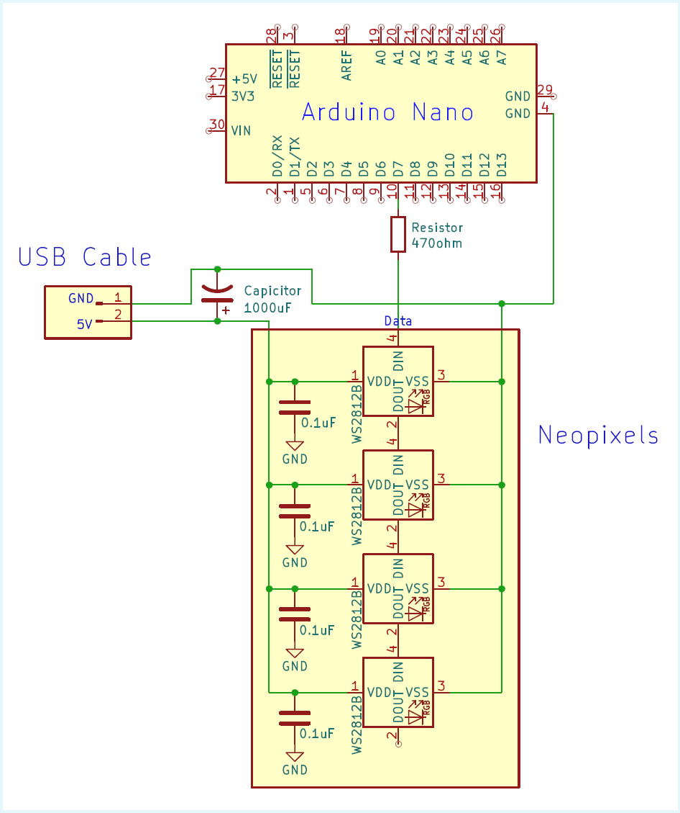

# Penn State Harrisburg IEEE NeoPixel Workshop

Build a 7‑LED NeoPixel project driven by an Arduino Nano and powered from a USB charger. This repo includes starter code, wiring/power notes, a step‑by‑step process, and troubleshooting.

## Quick Start
- Install the Arduino IDE.
- Install the “FastLED” library (Library Manager).
- Open `nanopixel_starter_code.ino`, set `NUM_LEDS` to 7, choose your data pin, and upload.
- Power the LED strip from a USB wall charger; power the microcontroller from your laptop.

## Wiring (summary)


- USB charger 5V -> LED strip 5V  
- USB charger GND -> LED strip GND  
- MCU GND -> LED strip GND (common ground)  
- MCU D7 -> 330–470 Ω -> LED DIN  
- 1000 µF electrolytic across LED 5V/GND near the first LED

Notes:
- Do not power the strip from the Nano’s 5V pin.
- If using a 3.3 V MCU (ESP32/ESP8266/RP2040), use a 74AHCT125/74HCT14 level shifter on the data line or lower LED V+ to ~4.3–4.5 V with a diode in series.

## Power Notes
- One 7‑LED strip worst case ≈ 7 × 60 mA = 0.42 A at 5 V (full white, full brightness).
- Cap brightness in code (e.g., 25–40%) for comfort and headroom.
- Our USB charging block can only handle up to 1A so be mindful of how you power the pixels.

## Starter Code (Nano, 5V logic)
See `starter_nano/starter_nano.ino`. Paste into the Arduino IDE.

```cpp
#include <FastLED.h>

#define DATA_PIN 7
#define NUM_LEDS 7
#define BRIGHTNESS 50  // ~25% to keep current modest

void setup() {
  delay(2000);
  FastLED.addLeds<WS2812, DATA_PIN, GRB>(leds, NUM_LEDS);
}

void loop() {
  for(int whiteLed = 0; whiteLed <NUM_LEDS; whiteLed = whiteLed + 1) {
    leds[whiteLed] = CRGB::White;
    FastLED.show();
    delay(100);
    leds[whiteLed] = CRGB::Black;
  }
}

ESP32/RP2040 Option
If you use 3.3 V boards, add a level shifter (SN74AHCT125/74HCT14) or drop LED V+ to ~4.3–4.5 V with a diode. See code/starter_esp32/starter_esp32.ino. (Work in progress, not added yet)

